## Detector de cutremur 
# atmega164p
- In acest proiect am realizat implementarea unui detector de cutremur cu sistem de avrtizare folosind un microcontroller atmega.
- Sistemul de avrtizare este realizat prin intermediul unor leduri si al unui buzzer (avertizare sonora).
- Documentatia si descrierea proiectului se regasesc in fisierul "Detector cutremur - documentatie" iar cerinta de proiectare in fisierul "Cerinta proiectare" la pagina 6.
- Simularile sunt realizate in SimulIDE.
- Codul este scris in limbaj C si transformat in fisier hex.
- O imagine a intregului sistem se regaseste in fisierul "Sistem-ss.png".

  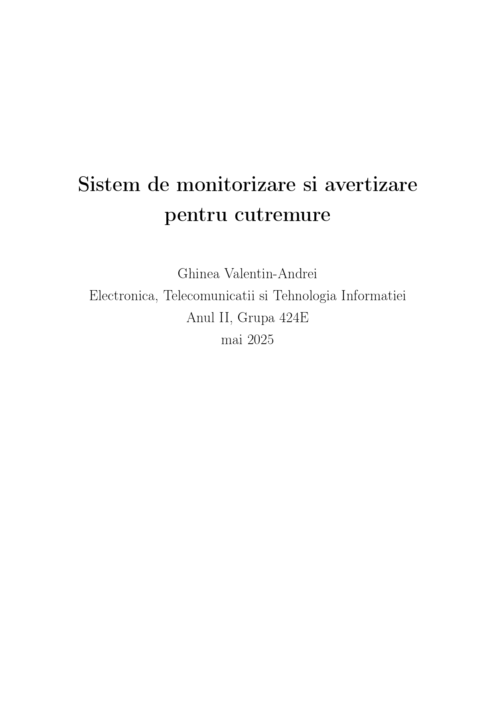

  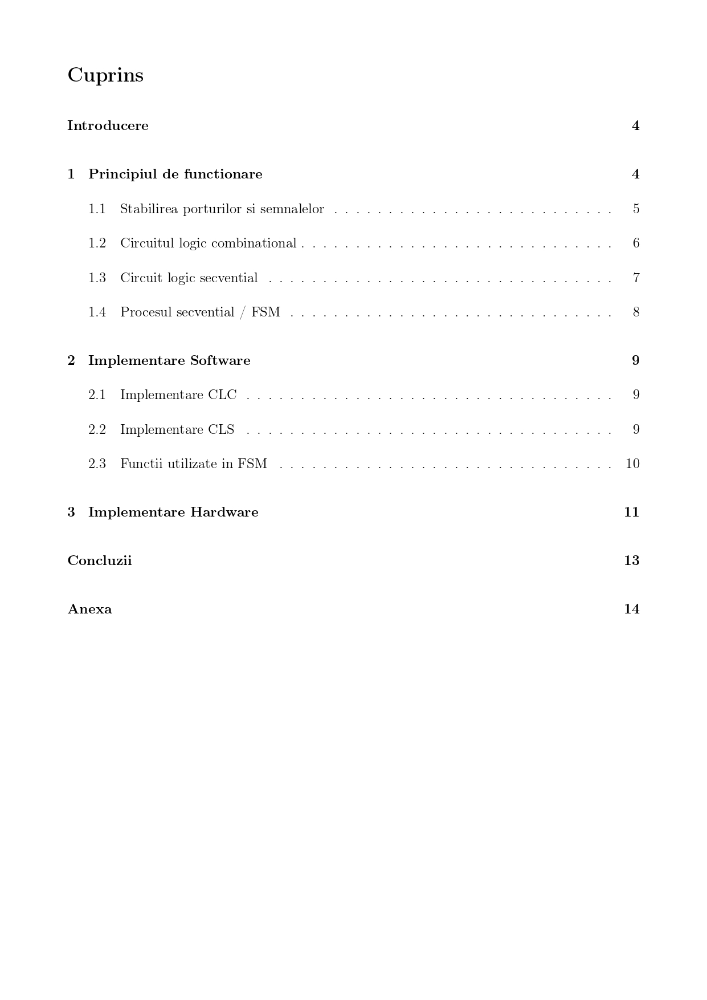

  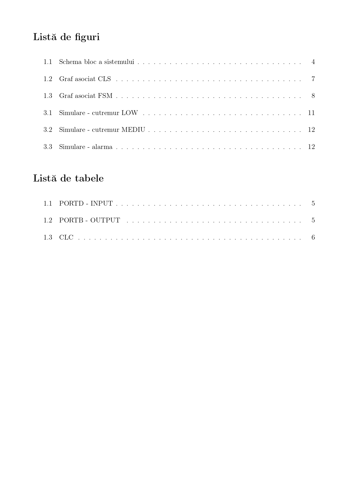

  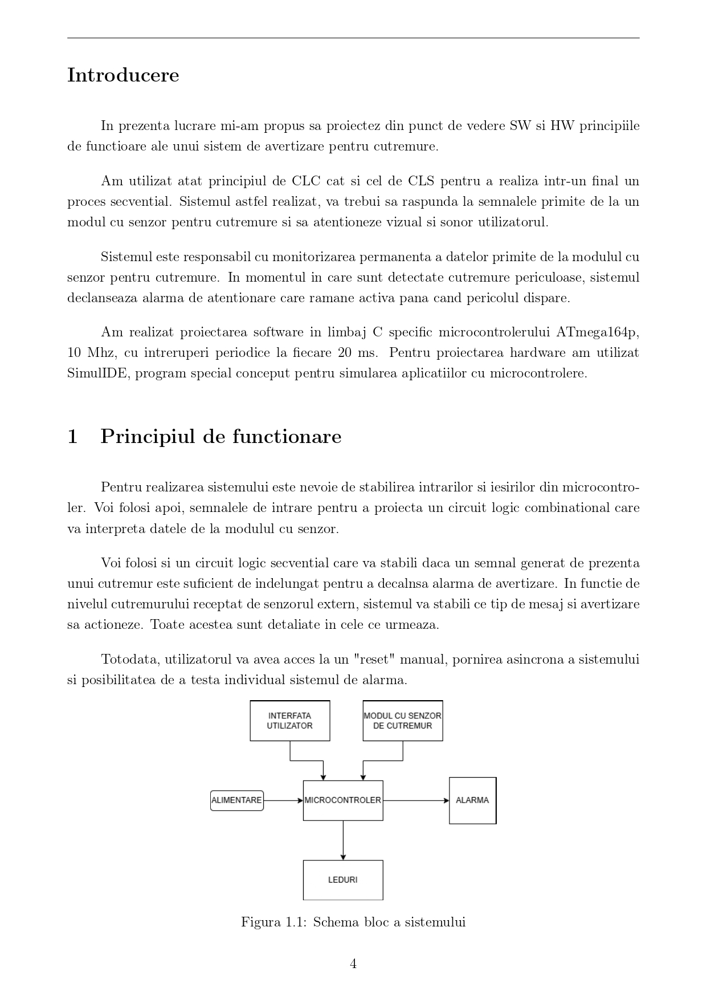

  

  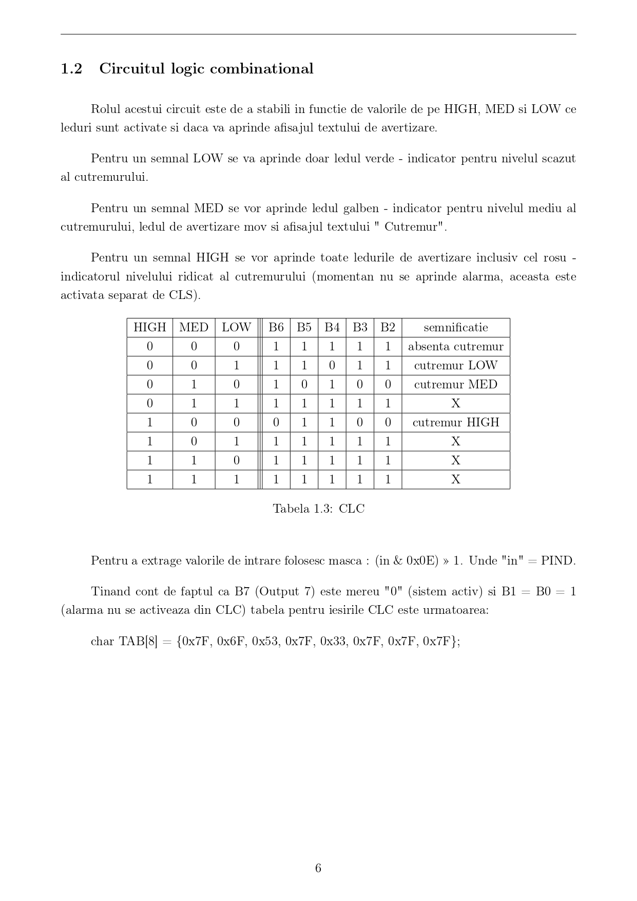

  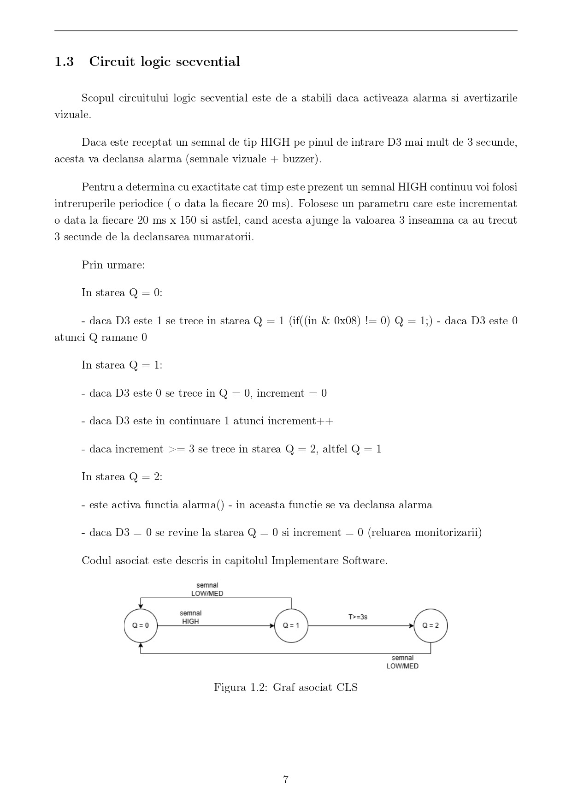

  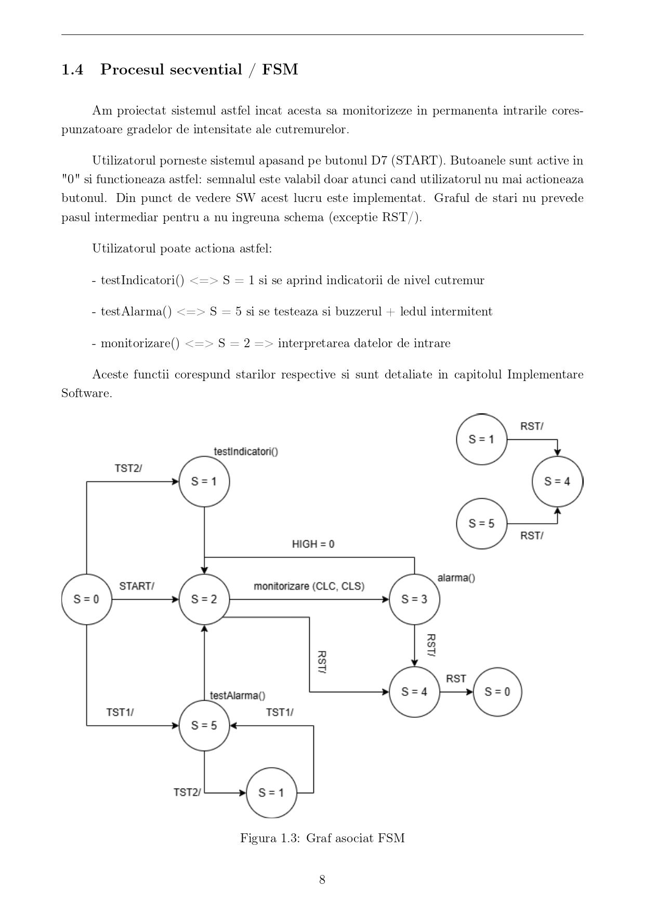

  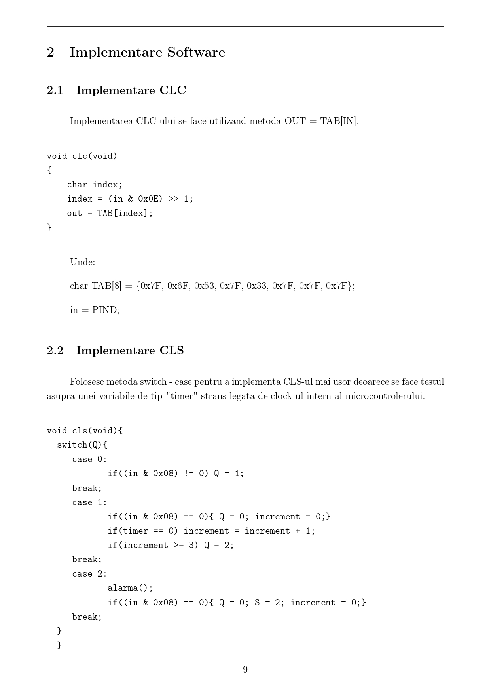

  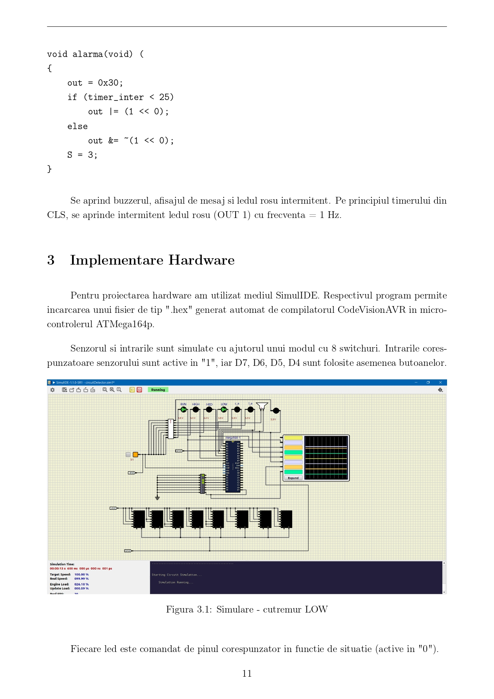

  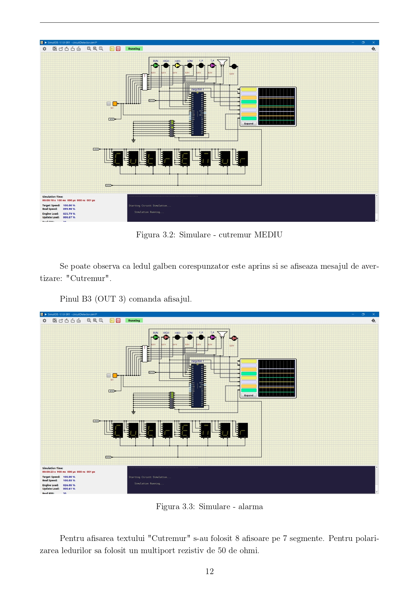

  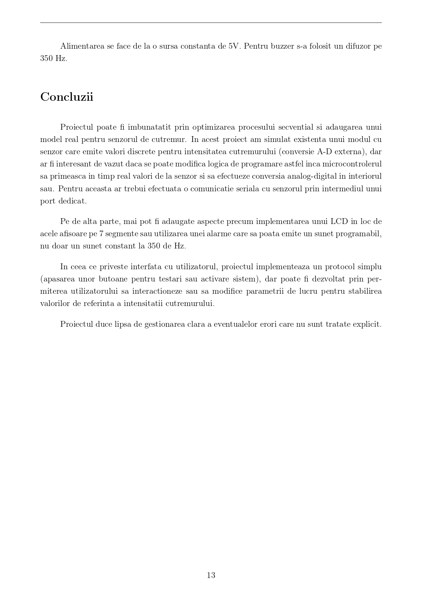

  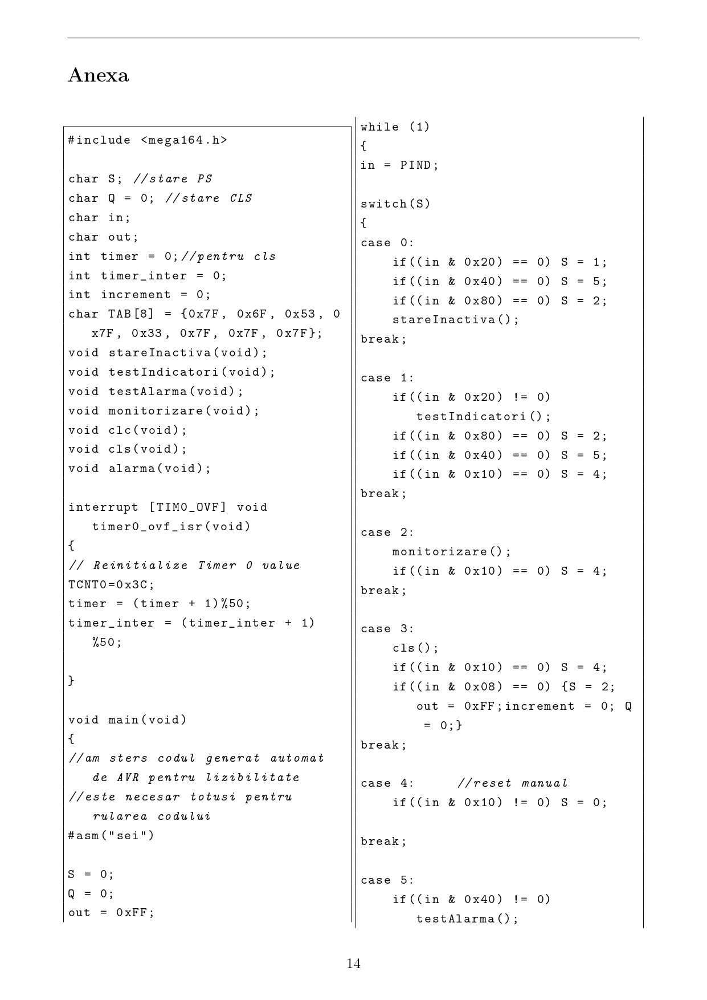

  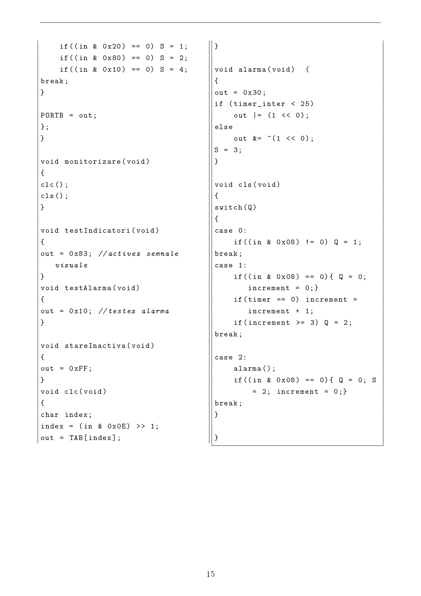

